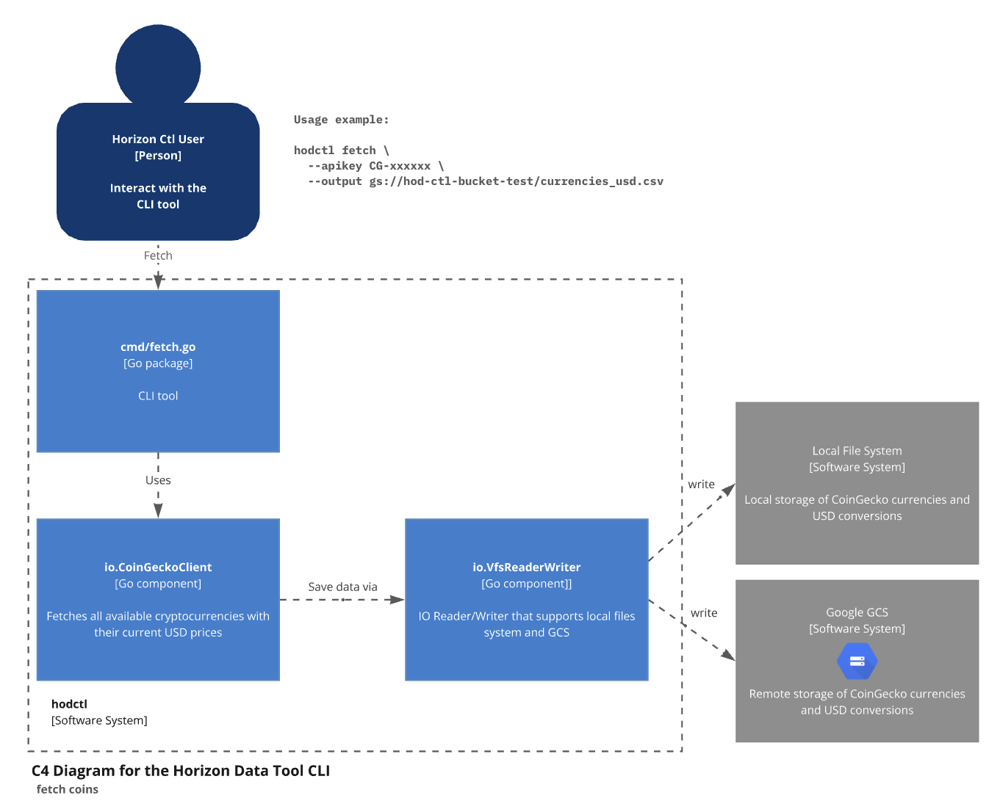
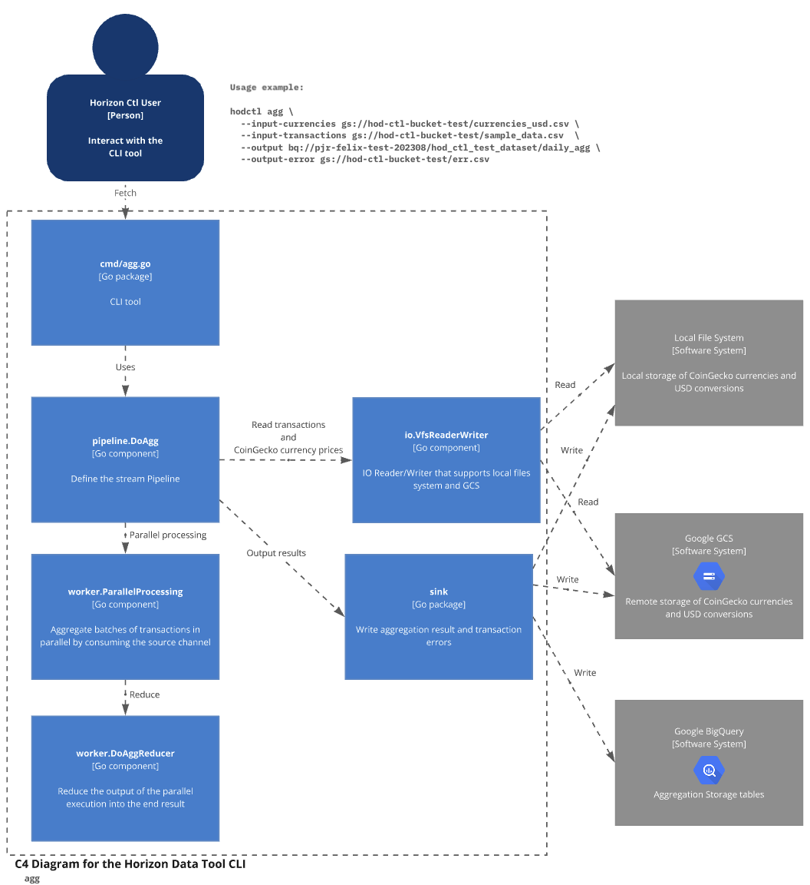
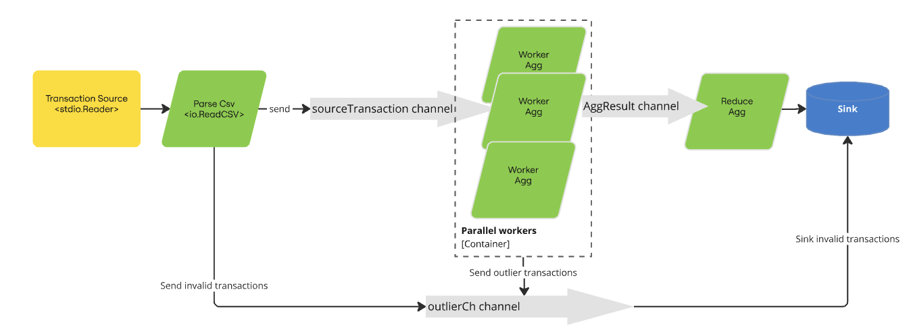

# Experimental Data Tool CLI in Go

> [!IMPORTANT]
> Use with caution, the only goal of this project is to explore how to implement from scratch and showcase advanced concepts and patterns in Go for data processing and streaming.

## Features

* Optimized for high throughput with low memory usage rather than pure performance; in particular, the memory behavior is predictable and adjustable.
* Parallel processing of transactions following a streaming approach.
* Distributed computing is not implemented, but the system is designed to be easily scalable thanks to the MapReduce pattern.
* Multiple I/O sources supported, including local files, GCS, S3, and BigQuery.
* Dead-letter output for invalid or outlier transactions, and data cleanup and outlier detection.

To work with a real use case, the CLI allows aggregation of transactions from a CSV file using the current prices.

> [!WARNING]  
> For this use case, this implementation is overkill for the size of the test data and type of operation. 
> It could have been implemented in a much simpler way using a basic in-memory map and a few goroutines, 
> or by leveraging one of the many ETL tools available, such as Apache Beam. T

## Architecture

The CLI offers two primary functionalities:

### 1. Fetch
This command retrieves the current price of all supported cryptocurrencies from the CoinGecko API and saves the data into a CSV file for later use.



### 2. Aggregate (Agg)
The aggregate command processes a CSV file containing transaction data and uses the current coin prices from CoinGecko to compute the aggregated values.



The aggregation functionality is designed as a streaming pipeline, built with bounded channels and micro-batch processing.

To efficiently handle large datasets, it implements a simple MapReduce Worker Sink pattern.


In a nutshell, the aggregation flow operates as follows:



By using this architecture, the CLI ensures that memory consumption is predictable and remains low, while still being able to handle a high throughput and process hundreds of millions of transactions in a single CSV file.

## Installation

To install the CLI, run the following command:

```bash
go install .
```

## Usage

```
$ hodctl agg --help

Welcome to Experimental Data Tooling CLI v0.1.0!
Aggregate the transaction data with currency conversion rates", 
and save the results as output

Usage:
  hodctl agg [flags]

Flags:
  -h, --help                        help for agg
  -c, --input-currencies string     Path to the currency value CSV file (gs, s3 and local file system supported) (required)
  -t, --input-transactions string   Path to the transactions CSV file (gs, s3 and local file system supported) (required)
  -b, --micro-batch-size int        Size of each micro-batch for processing (default 10000)
  -o, --output string               Path to save the aggregated result (BigQuery, gs, s3 and local file system supported) (required)
  -e, --output-error string         Path to save the error output CSV file  (gs, s3 and local file system supported) (required)
  -p, --parallelism int             Number of goroutines for parallel processing (default 14)
```

### Fetch the CoinGecko current price for all coins
```bash
# Fetch and save the current prices locally
hodctl fetch --apikey CG-xxxx --output ./testdata/currencies_usd.csv 

# Fetch and save the current prices to Google Cloud Storage (GCS)
# Ensure you have the correct permissions and are logged in using gcloud
# Command to authenticate: gcloud auth application-default login
hodctl fetch --apikey CG-xxxx --output gs://hod-ctl-bucket-test/currencies_usd.csv 
```

### Aggregate transactions

```bash
# Run with sample data
hodctl agg \
  --input-currencies ./testdata/currencies_usd.csv \
  --input-transactions ./testdata/sample_data.csv  \
  --output ./testdata/out.csv                      \
  --output-error ./testdata/err.csv

# Run with a large dataset (generate sample data using provided script)
./scripts/generate_big_sample_data.sh
hodctl agg --input-currencies ./testdata/currencies_usd.csv --input-transactions ./testdata/big_sample_data.csv --output ./testdata/out.csv --output-error ./testdata/err.csv --micro-batch-size 1000

# Run with data from GCS and save the output in GCS
hodctl agg --input-currencies gs://hod-ctl-bucket-test/currencies_usd.csv --input-transactions gs://hod-ctl-bucket-test/sample_data.csv --output gs://hod-ctl-bucket-test/out.csv --output-error gs://hod-ctl-bucket-test/err.csv

# Run with data from GCS and save the output to BigQuery
hodctl agg --input-currencies gs://hod-ctl-bucket-test/currencies_usd.csv --input-transactions gs://hod-ctl-bucket-test/sample_data.csv --output bq://pjr-felix-test-202308/hod_ctl_test_dataset/daily_agg --output-error gs://hod-ctl-bucket-test/err.csv
```

## Benchmarking

While there are several optimizations still to be made, initial benchmarks show promising performance.
The system can process **1 million rows in under 29 seconds** while keeping memory usage consistently low (below 30MB throughout the process).

```
 Benchmark result for parallelism: 14, microBatchSize: 100000, 28.951503 seconds/op
```

To run the benchmarks yourself, use the following command:
```bash
# This will test with different parallelism values and micro-batch sizes
go test -bench=. ./cmd
```

## Potential improvements

This first iteration and there are several improvements that can be made:

* BQ insert are based on streaming INSERT, which is not the most efficient way to insert data into BQ but for very large Dataset could have use BQ load job API.
* BQ sink does not MERGE the data, so it will append the data to the table, which could lead to duplicates. It'll add a performance cost, but using MERGE INTO could be a good improvement.
* Streaming could be optimized to use a more efficient way to handle the data, from basic things like avoid unnecessary data copy to more complex things like using off-heap memory, but this would require a lot of work and testing and it's a premature optimization at this point.
* Based on the final use case, partitions and clustering could be optimized to improve query performance.